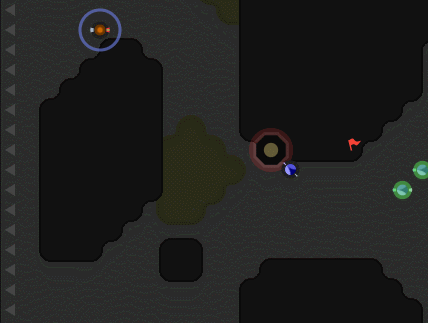
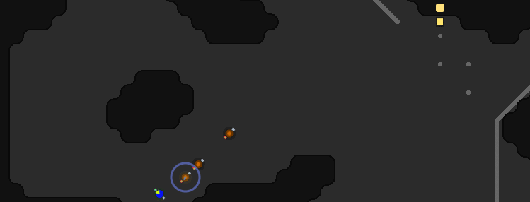
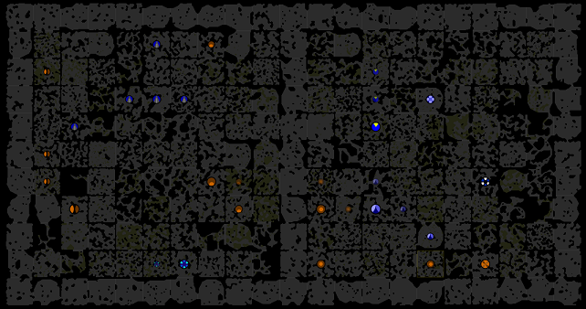

# Prolog

In a world far far away, the competition between The Titanium Creeps and the Dancing Squirrels has
evolved into a global and brutal war for the domination of the sector. During precisely 30 days,
the conflict raged on until one of them got finally defeated and flew in the hope of finding a
better place the settle.

This logbook was written by hiryus and describe the main events of the war.

# Day 1 (2017-11-17)

I chose to spawn in E11S7 for two reasons. First, it was easy to defend with small exits. Then, it
also had lemergium which I planned to use for boosting my healers.

My start was a bit slower than some other AIs because I was not remote mining, but I was not
worried: contrary to others, my rooms plan to get to RCL3 and build a tower on their own before the
safe mode drops. Thus I didn’t get bothered when other remote rooms got attacked.

At RCL3, I sent a claimer to E11S9. I was planning fast expansion while my enemies didn't have too
much power. As my first room was still under safe mode, the new one was basically defenseless, but
the energy invested was minimal.

SteveTrov decided to attack my workers while they were trying to build the spawn. His creeps
murdered them, removed the spawn construction site and sat there waiting for reinforcements. But
they never came. My AI didn’t bother to spend energy for the room, knowing that a safe mode would
be available later.

The attack was expected, but it was not a reason to acknowledge it. I decided to launch a
counterattack on E13S6, SteveTrov’s first remote mine. E11S7 spawned three attackers composed of
ATTACK and MOVE parts only. After some pathfinding approximations, they entered SteveTrov’s room
and began disturbing the remote mining operation.

While I was doing a quick update to include one HEAL part to my attackers body, SteveTrov reacted
and fixed a few bugs in his defenders behavior: they began kiting quite effectively. It was time to
stop the attack and plan something else.

I changed my target and my attackers started heading towards E13S3, Kasami’s remote mining room. I
was interested in blocking the room because it was also giving Kasami access to his second remote
mine:

While first successful, the attack was repelled a few hundreds ticks later by Kasami’s rangers which
were most of the time successfully kiting my melee attackers (though, they failed sometimes).

I decided to stop the hostilities for the night and went to sleep, hopping to see my second room
(E11S9) alive and healthy later in the morning.

By this time, the map situation looked like this:

# Day 2 (2017-11-17)

I woke up late and checked the situation. My second room was indeed healthy and had built a tower
during the night, good. E11S7, my main room was also RC4 and ready for another day of massacre.

First, I decided to claim E15S9. It was well protected in a dead-end and I needed the Oxygen it
contained. Despite completely messing up the process (forgetting to generate structures layouts and
destroyed the spawn twice…), the room finally started to work.

SteveTrov tried another time to step in, but my AI just activated safe mode and didn’t care much
about it. In the meantime, I sent a few attackers to E15S8 where he was building his second room. I
killed the first creeps and construction sites, but he sent a defensive squad which was way more
powerful than my creeps to stop it. That was a draw I guess.

When coming back to E11S7, I got the unpleasant surprise to find two large invaders messing up with
my main base operation… Unfortunately, they were quite effective and I had no way to clear them. I
had to be patient and wait for them to eventually die from old age.

When my room got back to nominal performances, I began sending creeps against RediJedi, helping
geir1983 to clear some rooms. Cooperation payed off and we destroyed two rooms and geir1983 was
also applying a lot of presure against RediJedi main base.

After some time, I stopped the attack, letting my ally containing the threat. Instead, I began an
attack against ricane’s first expansion. Unfortunately, Atavus got paid by the other team or
something: he was shooting my creeps before they get a chance to reach their targets.

But on tick 61747, SteveTrov launched a brutal attack on my main base which had still no walls.
Four rangers with heal parts stepped in, which was probably more than what my lone tower could
handle. Fortunately, they broke formation and the tower finally killed them:

Still, I was not really confident about the next attack. In parallel, he was also sending similar
squads against my remote mines for some time. My AI was ignoring them, sending remote miners back
in when the attacker were timing out.
